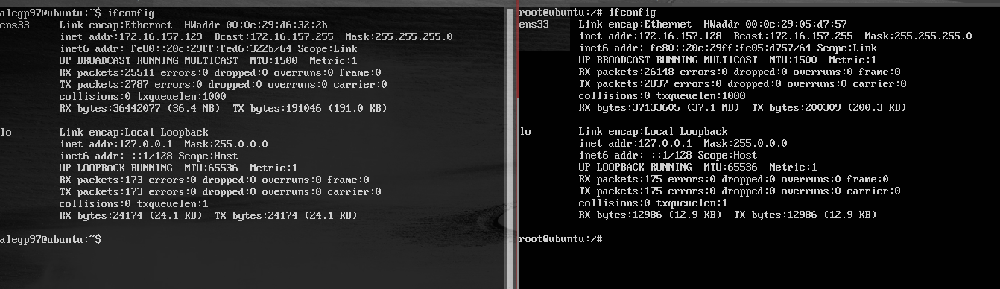
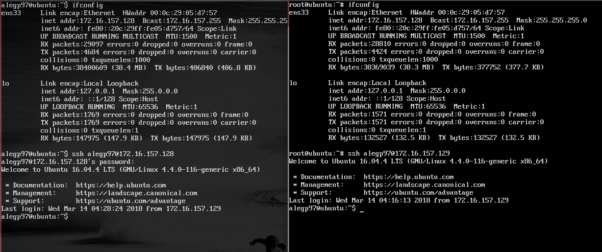
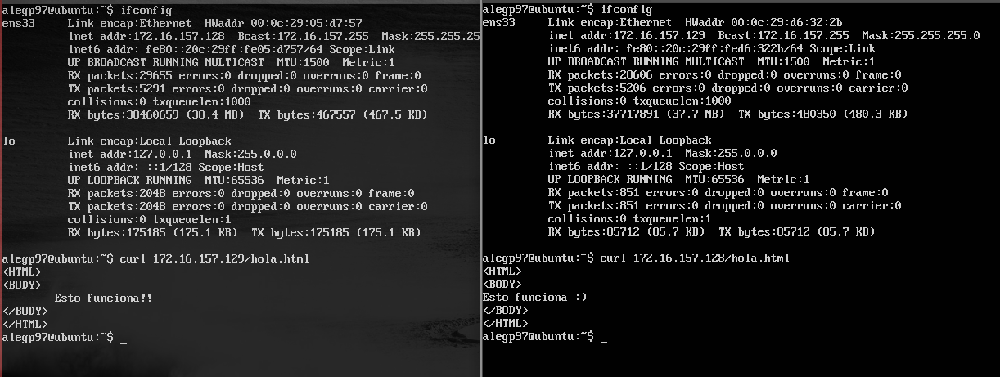

#Práctica 1: Preparación de las herramientas

*En esta práctica el objetivo es configurar las máquinas virtuales para trabajar en
prácticas posteriores, asegurando la conectividad entre dichas máquinas.Como resultado de la práctica 1 se mostrarán dos máquinas funcionando al
profesor en clase (accesos con curl para solicitar páginas web sencillas, así como el
acceso por SSH entre ambas máquinas).

Específicamente, hay que llevar a cabo las siguientes tareas:
1. acceder por ssh de una máquina a otra
2. acceder mediante la herramienta curl desde una máquina a la otra*

He usado para la realización de las prácticas:**VMWare Workstation 14**

Una vez configuradas las máquinas virtuales,
Lo primero y principal para conectarlas es conocer la IP: `ifconfig`

Máquina Principal - izquierda
Máquina Clonada	  - derecha

### Identificamos las máquinas por su dirección IP

Acceso mediante **SSH**

Las máquinas deben estar operativas y conocer los credenciales de acceso así como la dirección IP de la otra. La conexión se realiza mediante ssh <user>@<ip>.

Acesso mediante la herramienta **curl**

Se procede a descargar el archivo HTML del servidor web de la máquina usada. Es una herramienta de línea de comandos para transferir archivos con sintaxis URL que soporta diferentes protocolos aunque su uso habitual es automatizar transferencias de archivos o secuencias de operaciones no supervisadas.

