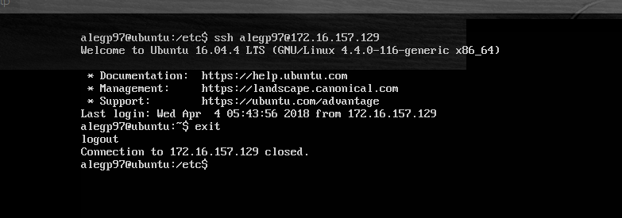

# Práctica 2: Clonar la información de un sitio web

*En esta práctica el objetivo es configurar las máquinas virtuales para trabajar en modo
espejo, consiguiendo que una máquina secundaria mantenga siempre actualizada la
información que hay en la máquina servidora principal.* 

Hay que llevar a cabo las siguientes tareas:
1. probar el funcionamiento de la copia de archivos por ssh
2. clonado de una carpeta entre las dos máquinas
3. configuración de ssh para acceder sin que solicite contraseña
4. establecer una tarea en cron que se ejecute cada hora para mantener
actualizado el contenido del directorio /var/www entre las dos máquinas

## Copia de archivos por SSH

Esto suele ser útil para la copia de algún archivo puntual o para crear directamente un archivo en nuestro servidor a través de ssh. 

Se comprime la carpeta actual (home) en la máquina 1 y es enviada a la máquina 2.

## Instalación rsync

Lo primero y principal es establecer como dueño del directorio web al usuario en cuestión (sin privilegios) de ambas máquinas: **sudo chown alegp97:alegp97 –R /var/www **

Para comprobar el funcionamiento de rsync se borra el contenido de un directorio de la máquina 2 y se clona en la máquina 1:

rsync -avz -e ssh user@ip:/dir/original/ /dir/destino/

Se pasar más argumentos a rsync como --exclude para excluir directorios o --delete para eliminar los archivos en la máquina origen. rsync -avz --delete --exclude=**/stats --exclude=**/error --exclude=**/files/pictures -e ssh maquina1:/var/www/ /var/www/

Nota. En rsync -avz -e

*a modo archivos.
v verbose, información extra.
z comprime el archivo para su envío.
e especifica la shell remota*

## Acceso sin contraseña para SSH

Utilizamos autentificación mediante un par de claves pública-privada para que cada vez que realicemos una conexión por ssh no nos pida contraseña y usuario pues es...bastante infructífero.

El primer paso es generar las claves mediante ssh-keygen: ssh-keygen -b 4096 -t rsa, después ejecutamos ssh-copy-id para copiar la clave de nuestro ordenador al servidor al que queremos conectar sin contraseña. ssh-copy-id <ip-servidor>

## Programación de tareas con crontab

Sabemos que cron es un administrador procesos en segundo plano que ejecuta procesos en el instante indicado en el fichero crontab, se pueden programar tareas para ser realizadas automáticamente cuando sea especificado. 
En esta práctica se pide establecer una tarea en cron para mantener actualizado el contenido de /var/www entre las dos máquinas. para ello, primero debemos identificar el servidor principal y el servidor secundario. En este caso he establecido como máquina principal la 172.16.157.128 y como máquina secundaria la 172.16.157.128. La tarea de backup debe ser ejecutada en la máquina secundaria.

Tarea que debe ser realizada cada 2 horas, así que añadimos a /etc/crontab: 0 */2 * * * rsync -avz -e ssh 172.16.157.128:/var/www/ /var/www/

Comprobamos que la tarea se cumple correctamente:

