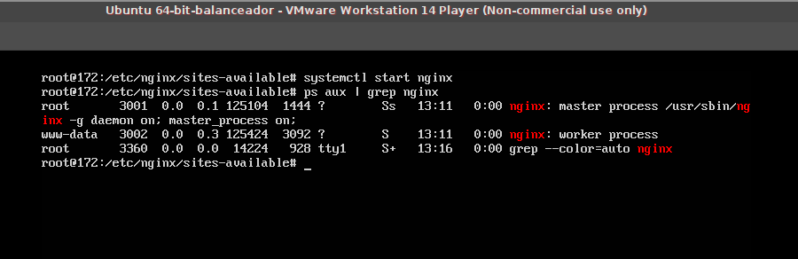
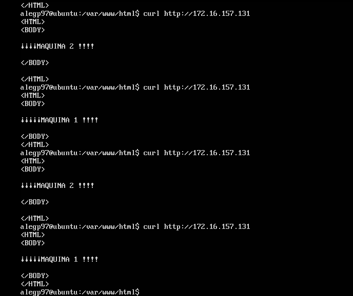
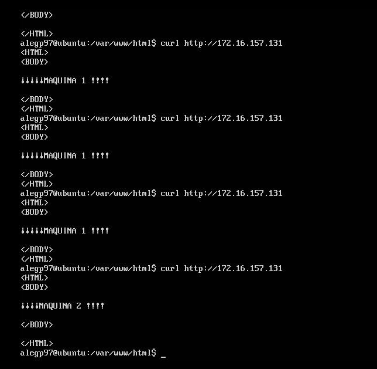
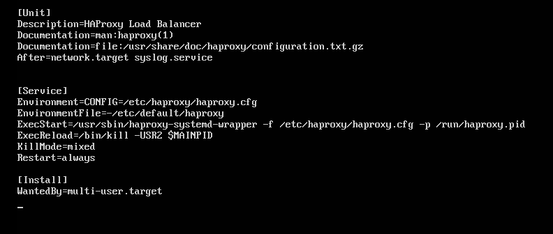
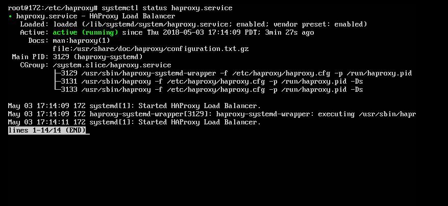

#Práctica 3: Balanceo de carga


*En esta práctica se llevarán a cabo, como mínimo, las siguientes tareas:*
1. *configurar una máquina e instalar el nginx como balanceador de carga*
2. *configurar una máquina e instalar el haproxy como balanceador de carga*
3. *someter a la granja web a una alta carga, generada con la herramienta Apache Benchmark, teniendo primero nginx y después haproxy.*


*En las tareas 1 y 2 debemos hacer peticiones a la dirección IP del balanceador y
comprobar que realmente se reparte la carga. Para ello, el index.html en las
máquinas finales deben ser diferentes para ver cómo las respuestas que recibimos al
hacer varias peticiones son diferentes (eso indicará que el balanceador deriva tráfico a
las máquinas servidoras finales).
Además, se comprobará el funcionamiento de los algoritmos de balanceo round-robin
y con ponderación (en este caso supondremos que la máquina 1 tiene el doble de
capacidad que la máquina 2).
En la tarea 3 debemos usar la herramienta ab para someter a una carga muy alta
(gran número de peticiones y con alta concurrencia) a la granja web, primero estando
nginx como balanceador, y a continuación estando haproxy como balanceador. Como
resultado, se debe realizar una comparación de los tiempos medios de servicio entre
ambos balanceadores, para poder determinar cuál funciona mejor.
Adicionalmente, y como tarea opcional para conseguir una mayor nota en esta práctica, se propone el uso de algún otro software de balanceo diferente a los dos
explicados en este guión (por ejemplo Pound).*


Las IPs son:

-172.16.157.128 como  servidor 1 (principal)
-172.16.157.129 como  servidor 2 (respaldo)
-172.16.157.131 como  balanceador **nginx**
-172.16.157.136 como balanceador **haproxy**
-172.16.157.137 como **cliente externo**

**Combiene** aclarar que cada vez que se cambie el archivo de configuración se debe reiniciar el servicio (nginx o haproxy) `sudo systemctl restart <servicio>`


#Nginx


Lo primero será es instalar nginx y activarlo:
`sudo apt install nginx`

`sudo systemctl enable nginx`
`sudo systemctl start nginx`

Para comprobar su correcto funcionamiento usando `ps aux | grep nginx` 




Vemos que el servicio está abierto.

Al igual que otros compañeros la configuración de nginx en el guión de prácticas no funcionaba del todo, porque depende mucho de las configuraciones de las máquinas virtuales.

El procedimiento aquí explicado ha sido sacado de  [DigitalOcean](https://www.digitalocean.com/community/tutorials/how-to-set-up-nginx-load-balancing).


Mediante la directiva nano (desde supersusuario) editamos el fichero */etc/nginx/sites-available/default*. Añadimos los servidores en cuestión al backend, y sustituimos la línea `try_files $uri $uri/ =404;`por `proxy_pass  http://backend;`. 
```
upstream backend  {
  server 172.16.157.128;
  server 172.16.157.129;
}
```

El funcionamiento del balanceador de carga empleado es el **round-robin** (por defecto)Con tal configuración, se accede el mismo número de veces a una máquina y a otra.





Podemos asignar diferentes capacidades de carga con **weight** indicando proporciones de tráfico.

```
upstream backend  {
     server 172.16.157.128 weight=3;  #máquina 1
     server 172.16.157.129 weight=1;  #máquina 2
}
```





La directiva `ip_hash` permite que cuando recibimos varias peticiones de la misma IP se redirigan al mismo servidor. 
Sin embargo el balanceo no será equilibrado cuando todos los usuarios vienen con una NAT o un proxy,  por lo que una solución es mantener abiertas la conexiónes durante algunos segundos..


```
upstream backend  {
    server 172.16.157.128 weight=2;  #máquina 1
    server 172.16.157.129 weight=1;  #máquina 2
    keepalive 3;
}

#Haproxy


**Instalamos y activamos** haproxy:
`sudo apt install haproxy`
`sudo systemctl enable haproxy && sudo systemctl start haproxy`


El archivo de configuración de haproxy es */etc/haproxy/haproxy.cfg*. Se debe sustituye el contenido del archivo por lo siguiente, tal y como se explica en [DigitalOcean](https://www.digitalocean.com/community/tutorials/how-to-set-up-nginx-load-balancing):

```
global
    log 127.0.0.1 local0
    chroot /var/lib/haproxy
    stats socket /var/lib/haproxy/stats level admin
    pidfile /var/run/haproxy.pid
    stats timeout 30s
    daemon
    maxconn 4000
    tune.ssl.default-dh-param 2048
    
defaults
    log global
    option dontlognull
    option redispatch
    timeout connect 5s
    timeout client 5s
    timeout server 10s
    
frontend http
    bind *:80
    mode http
    default_backend web-backend
    
backend web-backend
    balance roundrobin
    mode http
    server s1 172.16.157.128:80 check
    server s2 172.16.157.129:80 check
```

Así mismo editamos **haproxy.service** en */etc/systemd/system/multi-user.target.wants/haproxy.service*:



Tras modificar **haproxy.service**, ejecutamos `systemctl reload-daemon`. A continuación reiniciamos `systemctl restart haproxy`.

**Comprobamos** con `systemctl restart haproxy`

 


El funcionamiento del balanceador de carga empleado es el **round-robin** (por defecto)Con tal configuración, se accede el mismo número de veces a una máquina y a otra.


Al igual que con nginx con la directiva weight poodemos asignar diferentes capacidades de carga indicando proporciones de tráfico:

```
    backend web-backend
      balance roundrobin
      mode http
      server s1 172.16.157.128:80 check weight 200
      server s2 172.16.157.129:80 check weight 100
```
**s1 atenderá el doble de peticiones que s2**.


## Apache Benchmark. Someter a una alta carga el servidor balanceado

```ab -c 100 -n 1000 http:/localhost```


*This is ApacheBench, Version 2.3 <$Revision: 1706008 $>
Copyright 1996 Adam Twiss, Zeus Technology Ltd, http://www.zeustech.net/
Licensed to The Apache Software Foundation, http://www.apache.org/


.....

Concurrency Level:      100
Time taken for tests:   10.234 seconds
Complete requests:      10000
Failed requests:        0
Non-2xx responses:      10000
Total transferred:      4620000 bytes
HTML transferred:       2820000 bytes
Requests per second:    977.14 [#/sec] (mean)
Time per request:       102.340 [ms] (mean)
Time per request:       1.023 [ms] (mean, across all concurrent requests)
Transfer rate:          440.86 [Kbytes/sec] received

**Connection Times (ms)**
              min  mean[+/-sd] median   max
Connect:        0    2   3.4      1      43
Processing:    26  100  15.4     95     292
Waiting:       25   99  15.0     94     192
Total:         64  102  14.9     96     293

Percentage of the requests served within a certain time (ms)
  50%     96
  66%    109
  75%    111
  80%    112
  90%    116
  95%    121
  98%    151
  99%    162
 100%    293 (longest request)*

Para medir el rendimiento de los servidores la herramienta **Apache Benchmark** simula a través de la máquina externa muchas peticiones a cada uno de los balanceadores, exponiendo el rendimiento de cada uno de ellos. Para pruebas de la granja web usamos la misma carga.


**Haproxy es ganador**. En ambas pruebas se observa como time(s) | req/second | time/request(ms) | transfer rate(KB/s) | connect(ms) | processing(ms) | waiting(ms) | total(ms) son los menores. 

Los valores de peticiones/segundo y velocidad de transferencia son los mejores. **Y en la última tabla (con mayor carga) las diferencias son mayores

- nºpeticiones (-n): 10.000
-pet. concurrentes (-c): 30 

|  |     time(s)| req/second | time/request(ms) | transfer rate(KB/s) | connect(ms) | processing(ms) | waiting(ms) | total(ms) |
|---------| -----------| ---------- | ---------------- | ------------------- | ----------- | -------------- | ----------- | --------- |
| nginx |     5.793  | 1920.63    | 11.905           | 566.97              | 0           | 12             | 12          | 12        |
| haproxy |     4.002  | 2568.10    | 8.903            | 710.21              | 0           | 8              | 7           | 8        |


- nºpeticiones (-n): 60.000   ---  pet. concurrentes (-c): 60 

|  |      time(s) | req/second | time/request(ms) | transfer rate(KB/s) | connect(ms) | processing(ms) | waiting(ms) | total(ms) |
|---------| ------------ | ---------- | ---------------- | ------------------- | ----------- | -------------- | ----------- | --------- |
| nginx |      28.107  | 1901.26    | 28.852           | 553.00              | 0           | 28             | 29          | 29       |
| haproxy |      19.111  | 2512.08    | 19.043           | 722.91              | 0           | 17             | 17          |  17     |


