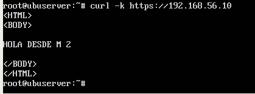

# Práctica 4: Asegurar la granja web

*El objetivo de esta práctica es configurar todos los aspectos relativos a la seguridad de
la granja web ya creada.
Hay que llevar a cabo las siguientes tareas obligatorias:*

1. *Instalar un certificado SSL para configurar el acceso HTTPS a los servidores.*
2. *Configurar las reglas del cortafuegos para proteger la granja web.*

*Nota: debido a diversos problemas de distinta índole con VMware, la práctica se ha realizado en VirtualBox, ahora:*

*-M1:  192.168.56.10*
*-M2:  192.168.56.11, servicio https activado y cortafuegos*


---

## Acceso por HTTPS

### Generar e instalar un certificado autofirmado

Instalamos un certificado SSL autofirmado (acceder mediante HTTPS)
Generamos e instalamos un certificado autofirmado y reiniciamos apache (apache2 enable mods)

`sudo a2enmod ssl`
`sudo service apache2 restart`

Configuramos el dominio, creamos la carpeta ssl si no estaba creada:

`mkdir /etc/apache2/ssl`

`sudo openssl req -x509 -nodes -days 365 -newkey rsa:2048 -keyout /etc/apache2/ssl/apache.key -out /etc/apache2/ssl/apache.crt`


A continuación debe activarse SSL en Apache, empleamos las siguientes ordenes:

`a2enmod ssl`

`service apache2 restart`

Editamos el archivo de configuración de SSL del sitio, y añadimos las siguientes líneas: 

`nano /etc/apache2/sites-available/default-ssl.conf`

```
SSLCertificateFile /etc/apache2/ssl/apache.crt
SSLCertificateKeyFile /etc/apache2/ssl/apache.key
```


Activamos el sito default-ssl y reiniciamos apache:

`a2ensite default-ssl`

`service apache2 reload`

Para comprobar la correcta instalación, haremos una **petición curl HTTPS**

`curl -k https://<ip>`


*-192.168.56.11 tiene HTTPS activo*
*-192.168.56.10 no tiene HTTPS activo*


Para solucionarlo se debe copiar la clave generada anteriormente al otro servidor y activar SSL.

La copia de las claves se realiza mediante rsync. En la máquina que a recibir los certificados ejecutamos:

`rsync -avz -e ssh <ip>:/etc/apache2/ssl/* /etc/apache2/ssl/`


Repetimos el proceso con el archivo */etc/apache2/sites-available/default-ssl.conf* 

`rsync -avz -e ssh <ip>:/etc/apache2/sites-available/default-ssl.conf /etc/apache2/sites-available/`
Activamos SSL y comprobamos que funciona correctamente.


En ambos servidores queda configurado SSL.




#### Activar SSL en Nginx

Debemos copiar el certificado SSL generado anteriormente al balanceador. 

`rsync -avz -e ssh <user>@<ip_origen>:/etc/apache2/ssl/* /etc/ssl/`

Editamos el archivo de configuración de Nginx: 

`nano /etc/nginx/sites-available/default`


Finalmente reiniciamos el servicio y comprobamos que funciona correctamente.

`service nginx restart`


## Configurar cortafuegos con IPTABLES


Un cortafuegos es un componente esencial que protege la granja web de accesos indebidos. Son dispositivos colocados entre subredes para realizar diferentes tareas de manejo de paquetes. Actúa como el guardián de la puerta al sistema web,permitiendo el tráfico autorizado y denegando el resto.

En general, todos los paquetes TCP/IP que entren o salgan de la granja web deben pasar por el cortafuegos, que debe examinar y bloquear aquellos que no cumplan los criterios de seguridad establecidos. Estos criterios se configuran mediante un conjunto de reglas, usadas para bloquear puertos específicos, rangos de puertos, direcciones IP, rangos de IP, tráfico TCP o tráfico UDP.
iptables es una herramienta de cortafuegos, de espacio de usuario, con la que el superusuario define reglas de filtrado de paquetes, de traducción de direcciones de red, y mantiene registros de log.

*para más ayuda:* `iptables -h`
Para comprobar el estado del cortafuegos ejecutamos:

`iptables –L –n -v`
Para configurar adecuadamente iptables en una máquina Linux, conviene establecer como reglas por defecto la denegación de TODO el tráfico, salvo el que permitamos después explícitamente. Una vez hecho esto, a continuación definiremos nuevas reglas para permitir el tráfico solamente en ciertos sentidos necesarios, ya sea de entrada o de salida. Por último, definiremos rangos de direcciones IP a los cuales aplicar diversas reglas, y mantendremos registros (logs) del tráfico no permitido y de intentos de acceso para estudiar más tarde posibles ataques.

Vamos a configurar el cortafuegos en una de las máquinas servidoras finales

Para lanzar, reiniciar o salvar las reglas establecidas en el cortafuegos respectivamente

```
service iptables start

service iptables restart

service iptables stop

service iptables save

```

Para bloquear todo el tráfico ICMP (ping) (y evitar ataques como el ping de la muerte):

`iptables -A INPUT -p icmp --icmp-type echo-request -j DROP`

Para abrir el puerto 53 para permitir el acceso a DNS:

`iptables -A INPUT -m state --state NEW -p udp --dport 53 -j ACCEPT`
`iptables -A INPUT -m state --state NEW -p tcp --dport 53 -j ACCEPT`

Bloquear todo el tráfico de entrada desde una IP:

`iptables -I INPUT -s IPbloqueada -j DROP`

Bloquear todo el tráfico de salida hacia una IP:

`iptables -I OUTPUT -s IPbloqueada -j DROP`

# Crear un script con las reglas para que se ejecute al arrancar el sistema

```
(1) Eliminar todas las reglas (configuración limpia)

iptables -F           -->vaciado de todas las reglas
iptables -X           -->borrado de todas las cadenas de reglas
iptables -Z           -->puesta a cero de todos los contadores de paquetes y bytes
iptables -t nat -F    -->vaciado de las reglas de la tabla NAT
(2) Política por defecto: denegar todo el tráfico

iptables -P INPUT DROP
iptables -P OUTPUT DROP
iptables -P FORWARD DROP
(3) Permitir cualquier acceso desde localhost (interface lo)

iptables -A INPUT -i lo -j ACCEPT
iptables -A OUTPUT -o lo -j ACCEPT
(4) Abrir el puerto 22 para permitir el acceso por SSH

iptables -A INPUT -p tcp --dport 22 -j ACCEPT
iptables -A OUTPUT -p tcp --sport 22 -j ACCEPT
(5) Abrir los puertos HTTP (80) de servidor web

iptables -A INPUT -p tcp --dport 80 -j ACCEPT
iptables -A OUTPUT -p tcp --sport 80 -j ACCEPT
(6) Abrir los puertos HTTPS (443) de servidor web

iptables -A INPUT -p tcp --dport 443 -j ACCEPT
iptables -A OUTPUT -p tcp --sport 443 -j ACCEPT

```

Para volver a la configuración de la máquina inicial y permitir todo el tráfico


**Eliminar todas las reglas (configuración limpia)**
iptables -F
iptables -X
iptables -Z
iptables -t nat -F
**política por defecto: aceptar todo**
iptables −P INPUT ACCEPT
iptables −P OUTPUT ACCEPT
iptables −P FORWARD ACCEPT
iptables -L -n -v


La salida es la siguiente:


Comprobar los puertos que hay abiertos:

`netstat -tulpn`

Para saber si está abierto o cerrado el puerto 80:

`netstat -tulpn | grep :80`


El primer paso es bloquear todo el tráfico y permitirlo a través de localhost (1), (2) y (3). Si aplicamos las reglas (4) y (5) logramos que SSH funcione y se podrá acceder por HTTP, pero no por HTTPS, entonces, aplicando la regla (6) conseguimos que se pueda acceder mediante HTTPS.


Como se observa, iptables queda correctamente configurado. Por lo tanto, debemos ejecutar el script al inicio del sistema para aplicar las nuevas reglas descritas. 

*En el archivo /etc/rc.local añadimos la siguiente línea para que se ejecute en el inicio del sistema:*

`sh /path/to/script.sh`


